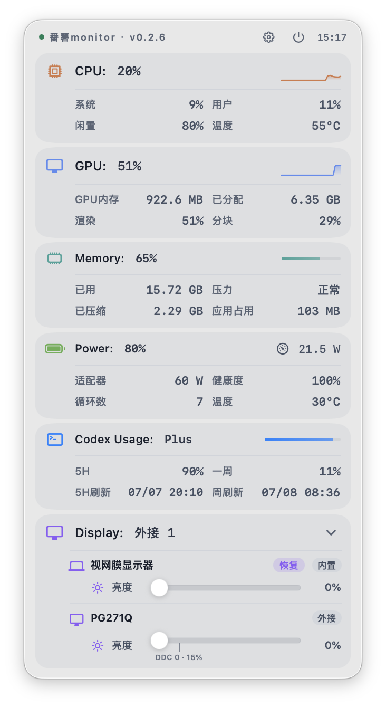
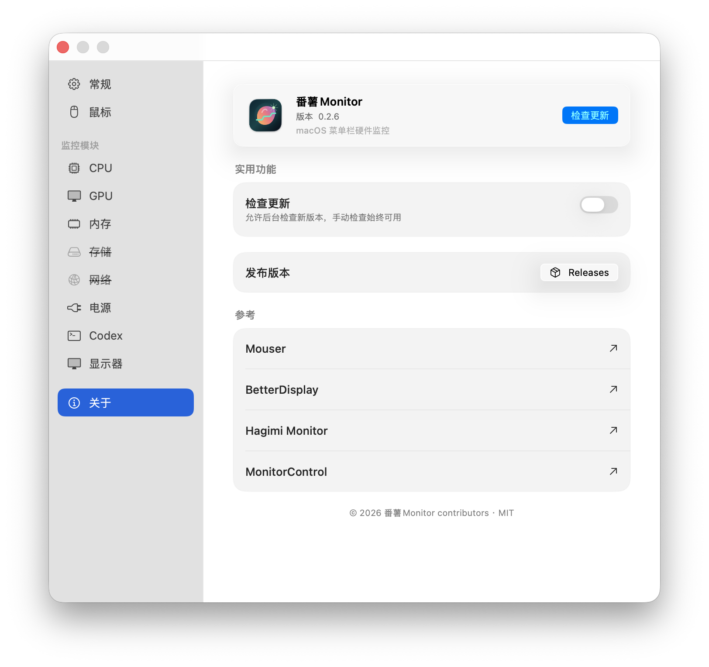
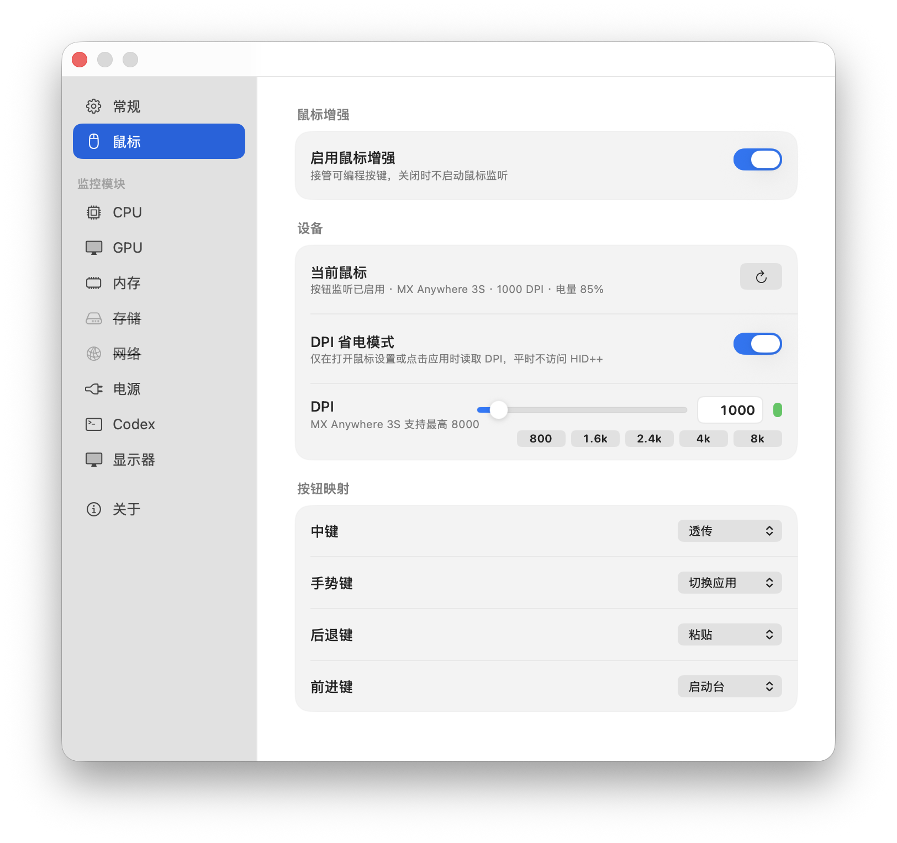

# Fanshu Monitor

A macOS menu bar system monitor and external display control utility for Apple Silicon.

<p align="center">
  
</p>

<p align="center">
  <a href="https://louis16s.github.io/fanshu_monitor/">Website</a> ·
  <a href="https://github.com/louis16s/fanshu_monitor/releases">Download</a> ·
  <a href="README.md">中文</a>
</p>

> Minimum macOS version: macOS 26.0. Apple Silicon Mac only.

## System Requirements

- Apple Silicon Mac
- Minimum macOS version: macOS 26.0
- External display brightness control requires a DDC/CI-capable display, cable, and connection path
- F1/F2 takeover and mouse button mapping require Accessibility permission

## Overview

Fanshu Monitor is a lightweight menu bar app for CPU, GPU, memory, battery, Codex quota, mouse, and display status. The direct distribution build can take over F1/F2 brightness keys based on the screen under your pointer, adjust DDC brightness for controllable external displays, and show the native macOS brightness overlay whenever possible.

Current version: `0.2.6`

## Highlights

- Menu bar panel for CPU, GPU, memory, battery, Codex quota, and display state
- External display brightness target follows the pointer
- Built-in and unsupported displays pass F1/F2 back to macOS
- Display capability, DDC state, and unsupported reasons are shown per display
- Hidden modules stop sampling, and panel-closed refresh slows down
- Memory panel shows the app's own memory footprint
- Mouse settings support MX Anywhere 3S DPI reads, DPI apply, and button mapping
- About settings include update checks, project links, and reference project notes

## Screenshots

If GitHub image caching is temporarily unavailable, open the [website](https://louis16s.github.io/fanshu_monitor/) for the full showcase.

<p align="center">
  
</p>

<p align="center">
  
</p>

<p align="center">
  
</p>

## Install

1. Open [Releases](https://github.com/louis16s/fanshu_monitor/releases)
2. Download the latest `FanshuMonitor.zip`
3. Unzip and move the bundled `番薯Monitor.app` to `Applications`
4. Grant Accessibility permission on first launch

If macOS blocks the unsigned app, run:

```bash
sudo xattr -cr /Applications/番薯Monitor.app
```

## Build

Use the project script to build Release, refresh `outputs/番薯Monitor.app` and `outputs/番薯Monitor.zip`, then launch the new app:

```bash
./script/build_and_run.sh --verify
```

Or build with Xcode directly:

```bash
xcodebuild -project 番薯monitor.xcodeproj -scheme 番薯Monitor -configuration Release -destination 'platform=macOS' build
```

## Website Deployment

The GitHub Pages site lives in `docs/`. In the GitHub repository, open `Settings` → `Pages`, choose `Deploy from a branch`, select `main`, and set the directory to `/docs`.

Deployed URL:

```text
https://louis16s.github.io/fanshu_monitor/
```

## License

MIT
