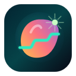
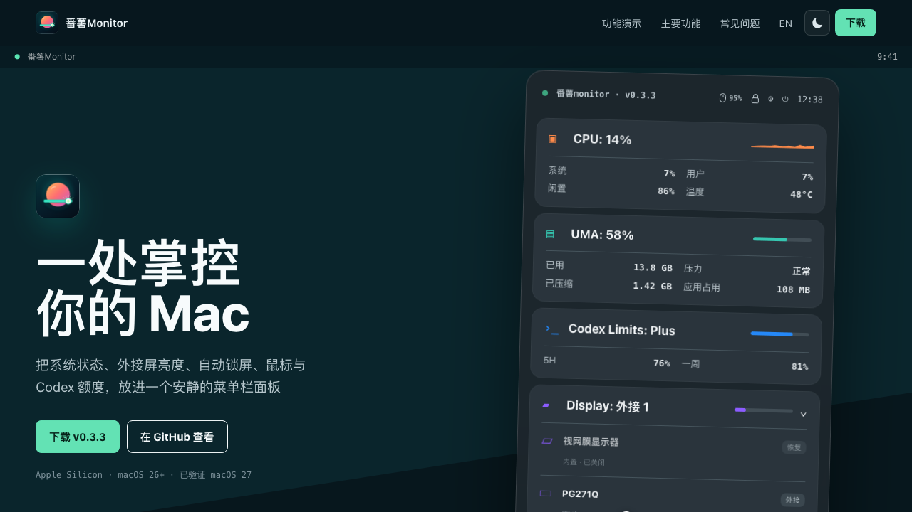

# 番薯Monitor

面向 Apple Silicon 的 macOS 菜单栏系统监控、外接显示器控制与自动锁屏工具。

<p align="center">
  
</p>

<p align="center">
  <a href="https://louis16s.github.io/fanshu_monitor/">官网</a> ·
  <a href="https://github.com/louis16s/fanshu_monitor/releases">下载</a> ·
  <a href="docs/README.en.md">English</a>
</p>

## 系统要求

- Apple Silicon Mac
- 最低系统版本：macOS 26.0
- 外接显示器亮度控制需要支持 DDC/CI 的显示器、线缆和连接方式
- F1/F2 接管、鼠标按键映射等功能需要授予辅助功能权限

## 简介

番薯Monitor 是一个轻量常驻的菜单栏应用，用来观察 CPU、GPU、内存、电源、Codex 额度、鼠标和显示器状态。它会根据鼠标所在屏幕分配 F1/F2 亮度键，在可控外接屏上调整 DDC 亮度，也能按不同时间段直接锁定系统。

当前版本：`0.2.9`

## 主要功能

- 菜单栏面板显示 CPU、GPU、内存、电池、Codex 额度和显示器状态
- 根据鼠标所在屏幕控制外接显示器亮度
- 内建屏和不可控外接屏会把 F1/F2 交回 macOS
- 显示每台屏幕的控制能力、DDC 状态和不可控原因
- DDC 故障按屏隔离，超时后自动熔断并退避重试
- 自动锁屏支持自定义时间段、跨天时间和独立闲置时长
- 隐藏模块停止对应采样，面板关闭后降低采样频率
- 网络、SSID、显示器探测、电池重遥测和 HID 数据按需加载
- 内存面板显示 App 自身内存占用，便于观察常驻开销
- 鼠标页支持 MX Anywhere 3S DPI 读取、设定和按键映射
- Codex 模块显示套餐、5H 与一周剩余额度和刷新时间
- 关于页提供更新检查、项目链接和参考项目说明

## 截图

下面是当前 `0.2.9` 官网与动态面板预览。可以直接访问 [官网](https://louis16s.github.io/fanshu_monitor/) 操作显示器、锁屏、鼠标和 Codex 演示。

<p align="center">
  
</p>

## 安装

1. 打开 [Releases](https://github.com/louis16s/fanshu_monitor/releases)
2. 下载最新版本的 `FanshuMonitor.zip`
3. 解压后将里面的 `番薯Monitor.app` 移到 `Applications`
4. 首次启动后授予辅助功能权限

如果 macOS 因未公证而阻止打开，可以执行：

```bash
sudo xattr -cr /Applications/番薯Monitor.app
```

## 构建

推荐使用项目内统一脚本，它会构建 Release、刷新 `outputs/番薯Monitor.app` 和 `outputs/番薯Monitor.zip`，并打开新版应用：

```bash
./script/build_and_run.sh --verify
```

也可以直接使用 Xcode：

```bash
xcodebuild -project 番薯monitor.xcodeproj -scheme 番薯Monitor -configuration Release -destination 'platform=macOS' build
```

## 官网部署

官网文件位于 `docs/`。在 GitHub 仓库中进入 `Settings` → `Pages`，选择 `Deploy from a branch`，分支选 `main`，目录选 `/docs`。

部署后地址：

```text
https://louis16s.github.io/fanshu_monitor/
```

## 品牌资源

Logo 的可编辑源稿位于 [`scripts/logo.html`](scripts/logo.html)，完全使用 HTML 与 CSS 绘制。App Icon、网站图标和 README 图标都由这份源稿统一渲染。

## 许可证

本项目使用 [MIT License](LICENSE)。

项目中吸收或参考了 MonitorControl、Hagimi Monitor、Mouser 等开源项目的思路和部分实现。第三方许可与来源说明见 [THIRD_PARTY_NOTICES.md](docs/THIRD_PARTY_NOTICES.md)。

## 安全

权限、Codex 额度读取与发行包校验说明见 [SECURITY.md](docs/SECURITY.md)。
