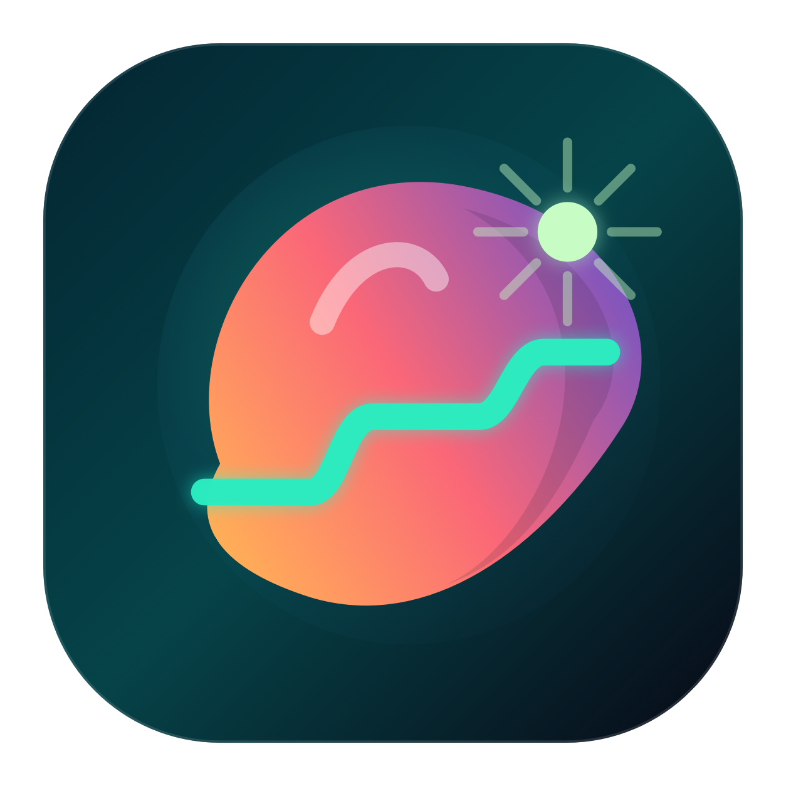
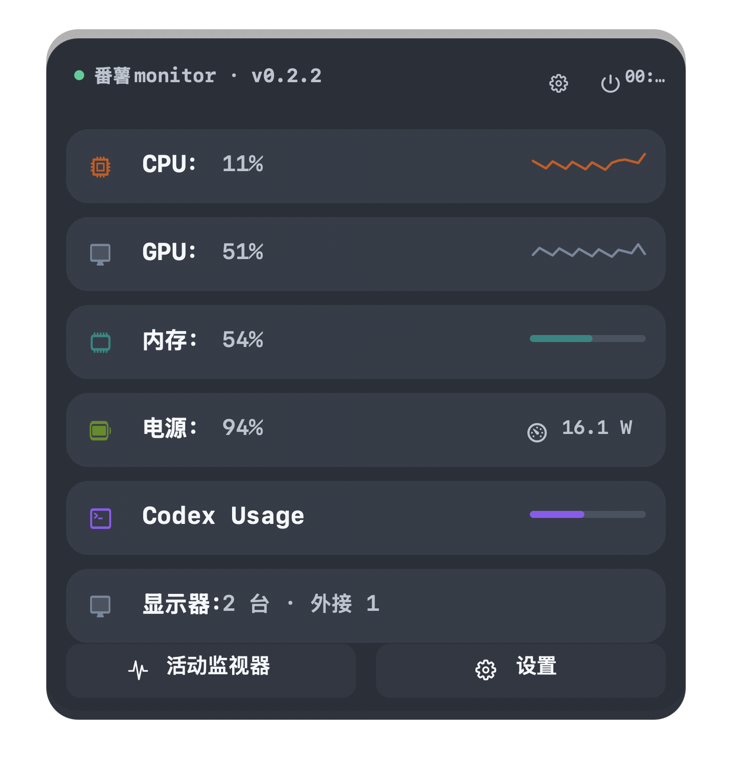
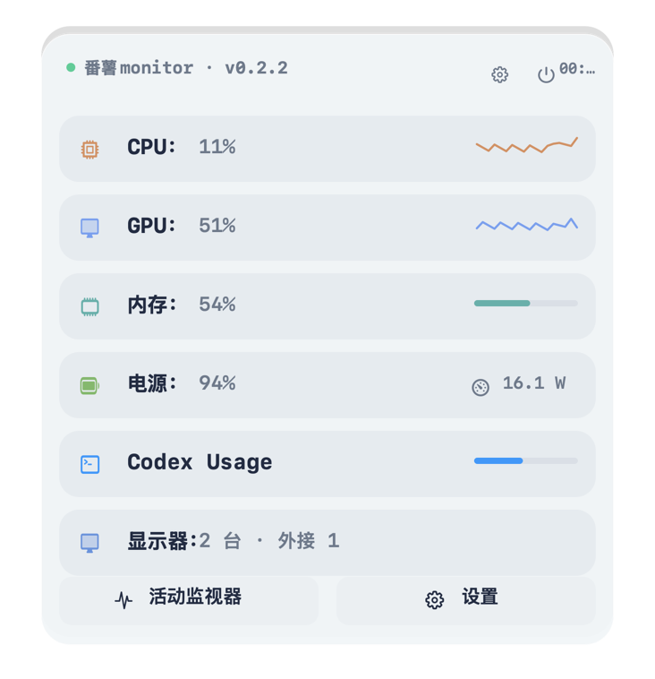
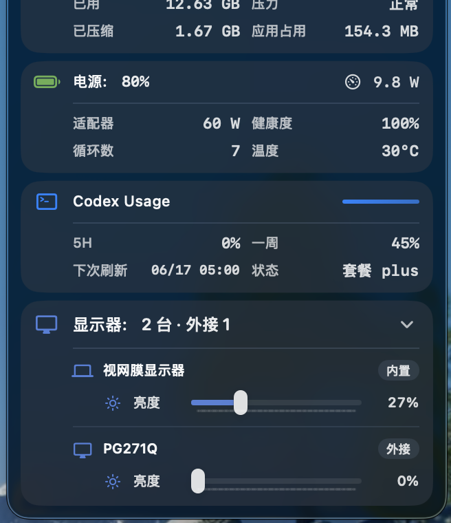
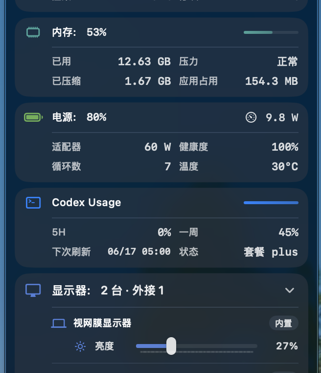
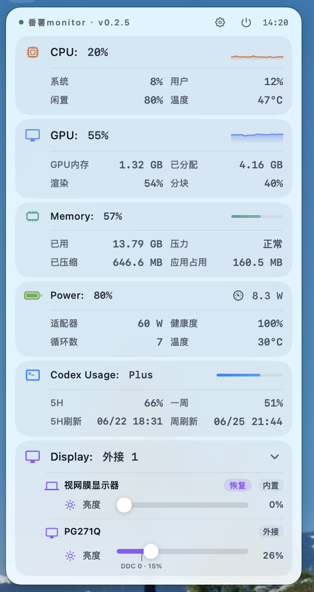

# 番薯Monitor

> [English](README.en.md)

<p align="center">
  
</p>

<p align="center">
  <strong>macOS 菜单栏系统监控工具</strong>
</p>

<p align="center">
  Swift 原生开发，常驻内存约 30 MB。用一枚动态圆环和一块紧凑面板，把核心系统状态讲清楚。
</p>

<p align="center">
  <a href="#安装">安装</a> ·
  <a href="#功能亮点">功能亮点</a> ·
  <a href="#截图">截图</a> ·
  <a href="#系统要求">系统要求</a>
</p>

## Star History

<p align="center">
  <a href="https://star-history.com/#louis16s/fanshu_monitor&Date">
    <picture>
      <source media="(prefers-color-scheme: dark)" srcset="https://api.star-history.com/svg?repos=louis16s/fanshu_monitor&type=Date&theme=dark" />
      <source media="(prefers-color-scheme: light)" srcset="https://api.star-history.com/svg?repos=louis16s/fanshu_monitor&type=Date" />
      
    </picture>
  </a>
</p>

<p align="center">
  如果这个项目对你有帮助，欢迎点一个 ⭐ 支持持续维护。
</p>

## 截图

### 多主题配色

番薯Monitor 内置语义化配色系统，所有模块色、玻璃背景、分隔线、进度轨道、状态色和显示器控制区域都由统一的 Palette 解析。当前提供「平衡」与「活力」两套风格，并完整适配浅色 / 深色模式。

| 平衡 · 深色 | 平衡 · 浅色 |
| --- | --- |
|  |  |

| 活力 · 深色 | 活力 · 浅色 |
| --- | --- |
|  |  |

后续会继续增加更多预设配色，并开放自定义色彩方案配置，让你可以按自己的桌面风格调整监控面板。

### 展开后的丰富数据

默认状态保持紧凑，展开后可以查看 CPU、GPU、内存、存储等模块的更完整细节，既能快速扫一眼，也能在需要时深入确认。

<p align="center">
  
</p>

## 功能亮点

### 一目了然的核心系统数据

番薯Monitor 聚焦最核心、最有效的系统指标：CPU、GPU、内存、存储、网络和电池。面板避免堆砌无意义字段，把真正影响当前机器状态的数据放在最容易扫读的位置。

### 动态圆环显示综合负载

菜单栏图标不是静态装饰。番薯Monitor 会综合 CPU 与 GPU 负载，平滑计算当前系统压力，并通过动态圆环直观展示整体状态：轻载、忙碌、接近高压，一眼就能判断。

### Swift 原生，轻量常驻

应用使用 Swift / SwiftUI 原生开发，面向 Apple Silicon 优化。日常常驻内存约 30 MB，适合作为长期挂在菜单栏里的系统状态面板。

### 统一配色系统

配色不是简单换一组颜色，而是由统一 Palette 管理：

- 模块强调色：CPU、GPU、内存、存储、网络、电池和显示器各自拥有清晰识别度。
- 玻璃质感：行背景、分隔线和进度轨道会随主题协调变化。
- 状态表达：正常、警告、高压状态使用独立语义色，避免和模块色混淆。
- 浅深色适配：每套配色都同时覆盖浅色和深色模式。

### 显示器控制

番薯Monitor 支持在菜单栏面板内控制显示器亮度、音量和对比度，让外接显示器也能融入同一个工作流。

需要注意：显示器控制依赖显示器、线材、连接方式和系统环境支持，外接显示器通常需要支持 DDC/CI 协议；不支持的控制项不会强行展示为可用功能。

## 安装

1. 从 [Releases](https://github.com/louis16s/fanshu_monitor/releases) 下载最新版 `.dmg`
2. 打开 DMG，将 番薯Monitor 拖入 Applications 文件夹

## 未公证应用放行

番薯Monitor 目前未经过 Apple 公证，macOS 会阻止打开。安装后在终端执行：

```bash
sudo xattr -cr /Applications/番薯Monitor.app
```

之后即可正常启动。

## 系统要求

- macOS 26 及以上
- Apple Silicon (M 系列芯片)

## 当前监控范围

- CPU：整体占用、系统 / 用户 / 空闲、运行时间
- GPU：图形负载、渲染 / 分块、显存信息
- 内存：使用率、内存压力、交换内存
- 存储：系统磁盘和外置卷容量状态
- 网络：上传 / 下载速率
- 电池：电量、供电状态、功耗、健康度等可用信息
- 显示器：亮度、音量、对比度控制，取决于设备 DDC/CI 支持情况

## 构建

```bash
xcodebuild -project 番薯monitor.xcodeproj -scheme 番薯Monitor -configuration Debug build
```

## 许可证

MIT
