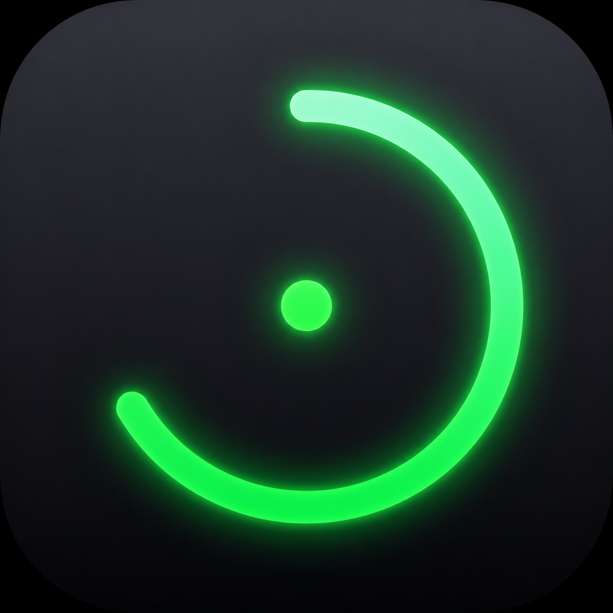
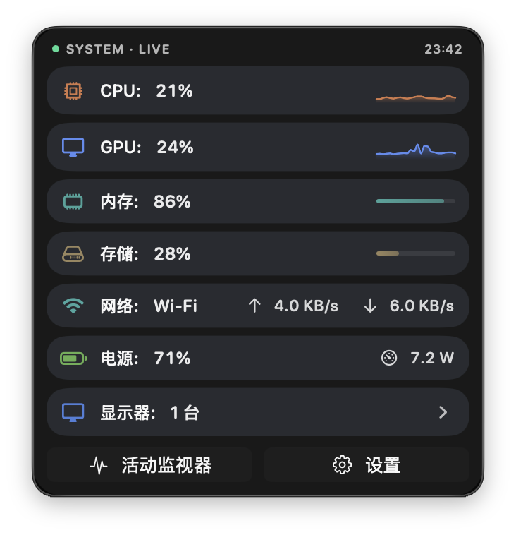
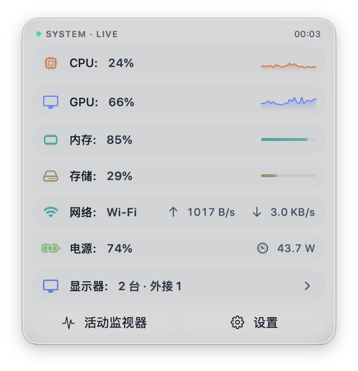
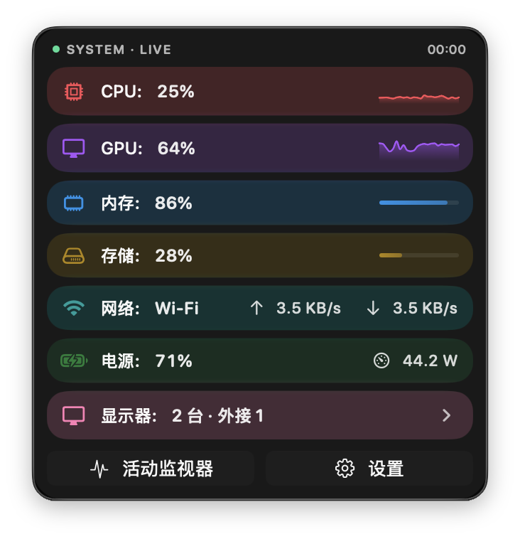
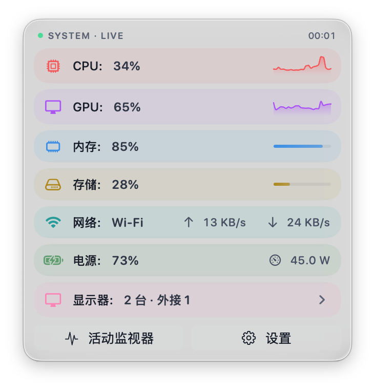

# 番薯Monitor

<p align="center">
  
</p>

<p align="center">
  <strong>macOS Menu Bar System Monitor</strong>
</p>

<p align="center">
  Native Swift, stays around 30 MB. A dynamic ring and a compact panel tell you what matters.
</p>

<p align="center">
  <a href="#installation">Installation</a> ·
  <a href="#highlights">Highlights</a> ·
  <a href="#screenshots">Screenshots</a> ·
  <a href="#requirements">Requirements</a>
</p>

## Star History

<p align="center">
  <a href="https://star-history.com/#louis16s/fanshu_monitor&Date">
    <picture>
      <source media="(prefers-color-scheme: dark)" srcset="https://api.star-history.com/svg?repos=louis16s/fanshu_monitor&type=Date&theme=dark" />
      <source media="(prefers-color-scheme: light)" srcset="https://api.star-history.com/svg?repos=louis16s/fanshu_monitor&type=Date" />
      
    </picture>
  </a>
</p>

<p align="center">
  If this project helps you, a ⭐ would mean a lot for continued maintenance.
</p>

## Screenshots

### Multi-Theme Color Schemes

番薯Monitor includes a semantic color system. All module colors, glass backgrounds, dividers, progress tracks, status colors, and display controls are resolved through a unified Palette. Currently offers "Balanced" and "Vibrant" styles, fully adapted for light / dark mode.

| Balanced · Dark | Balanced · Light |
| --- | --- |
|  |  |

| Vibrant · Dark | Vibrant · Light |
| --- | --- |
|  |  |

More presets will be added, with custom color scheme configuration to match your desktop style.

### Expanded Rich Data

The default state stays compact; expanding reveals more complete details for CPU, GPU, memory, storage, and more. Quick scan or deep dive — your choice.

<p align="center">
  
</p>

## Highlights

### Core System Data at a Glance

番薯Monitor focuses on the most essential system metrics: CPU, GPU, memory, storage, network, and battery. The panel avoids clutter, placing truly impactful data in the most scannable positions.

### Dynamic Ring Shows Combined Load

The menu bar icon is not static decoration. 番薯Monitor combines CPU and GPU load, smoothly calculates current system pressure, and displays it through a dynamic ring: light load, busy, or near critical — instantly visible.

### Native Swift, Lightweight Resident

Built with Swift / SwiftUI, optimized for Apple Silicon. Daily memory footprint around 30 MB, perfect for long-term residence in the menu bar.

### Unified Color System

Colors are not just swapped — they are managed by a unified Palette:

- Module accent colors: CPU, GPU, memory, storage, network, battery, and display each have clear visual identity.
- Glass texture: Row backgrounds, dividers, and progress tracks coordinate with the theme.
- Status semantics: Normal, warning, and critical states use independent semantic colors, separate from module colors.
- Light / dark adaptation: Each color scheme covers both light and dark modes.

### Display Controls

番薯Monitor supports brightness, volume, and contrast control for external displays directly from the menu bar panel, integrating external monitors into the same workflow.

Note: Display control depends on display, cable, connection, and system environment support. External displays typically need DDC/CI protocol support; unsupported controls are not shown as available.

## Installation

1. Download the latest `.dmg` from [Releases](https://github.com/louis16s/fanshu_monitor/releases)
2. Open the DMG and drag 番薯Monitor to your Applications folder

## Allowing Unsigned Apps

番薯Monitor is currently not notarized by Apple, so macOS will block it. After installation, run in Terminal:

```bash
sudo xattr -cr /Applications/番薯Monitor.app
```

Then launch normally.

## Requirements

- macOS 26 or later
- Apple Silicon (M-series chips)

## Current Monitoring Scope

- CPU: overall usage, system / user / idle, uptime
- GPU: graphics load, render / tiler, VRAM info
- Memory: usage rate, memory pressure, swap
- Storage: system disk and external volume capacity
- Network: upload / download rates
- Battery: level, power status, power consumption, health, and other available info
- Display: brightness, volume, contrast control (depends on DDC/CI support)

## Build

```bash
xcodebuild -project 番薯monitor.xcodeproj -scheme 番薯Monitor -configuration Debug build
```

## License

MIT
